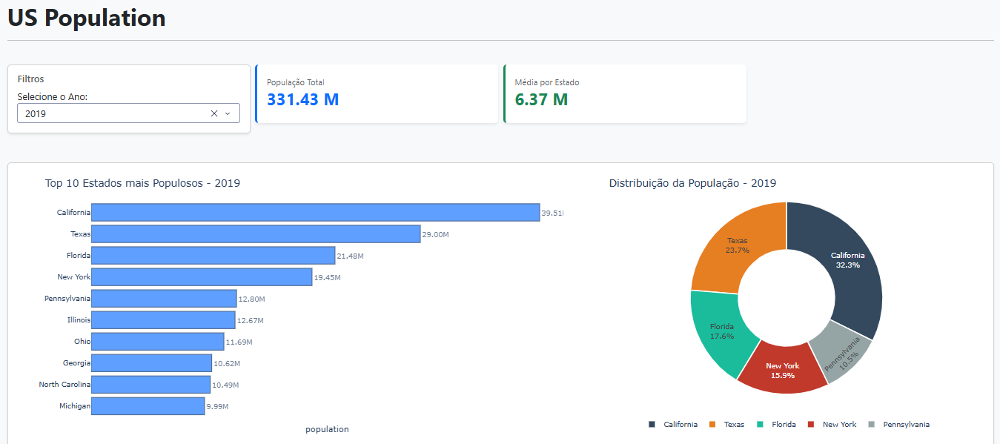

# Simple Dash - População dos EUA

Este projeto é um dashboard interativo desenvolvido com **Python** e a biblioteca **Dash**, focado na análise da evolução populacional dos estados americanos entre 2010 e 2019. O objetivo principal foi aplicar conceitos de arquitetura modular e boas práticas de desenvolvimento de software (Clean Code).

## 🎯 Objetivos do Projeto
O foco não foi apenas criar gráficos, mas sim construir uma aplicação escalável e organizada, utilizando:
* **Programação Orientada a Objetos (POO)** para gestão de dados.
* **Modularização** (Separação entre lógica de dados, visualização e interface).
* **UI/UX Responsiva** com Bootstrap.

## 🚀 Tecnologias Utilizadas
* **Python 3.x**
* **Dash & Plotly**: Para a interface reativa e gráficos dinâmicos.
* **Dash Bootstrap Components (DBC)**: Para o layout responsivo e estilização de temas.
* **Pandas**: Para a manipulação e limpeza de dados.
* **Font Awesome**: Para ícones nos cards de KPI.



## 🏗️ Arquitetura e Organização
O projeto foi estruturado seguindo o padrão de separação de responsabilidades:

```text
├── app.py              # Instância da aplicação Dash
├── index.py            # Layout principal e orquestração de Callbacks
├── modules/
│   ├── datamanager.py  # Classe POO para carga, limpeza e filtragem de dados
│   └── graphs.py       # Funções puras para geração de figuras Plotly
└── data/               # Base de dados (CSV)
